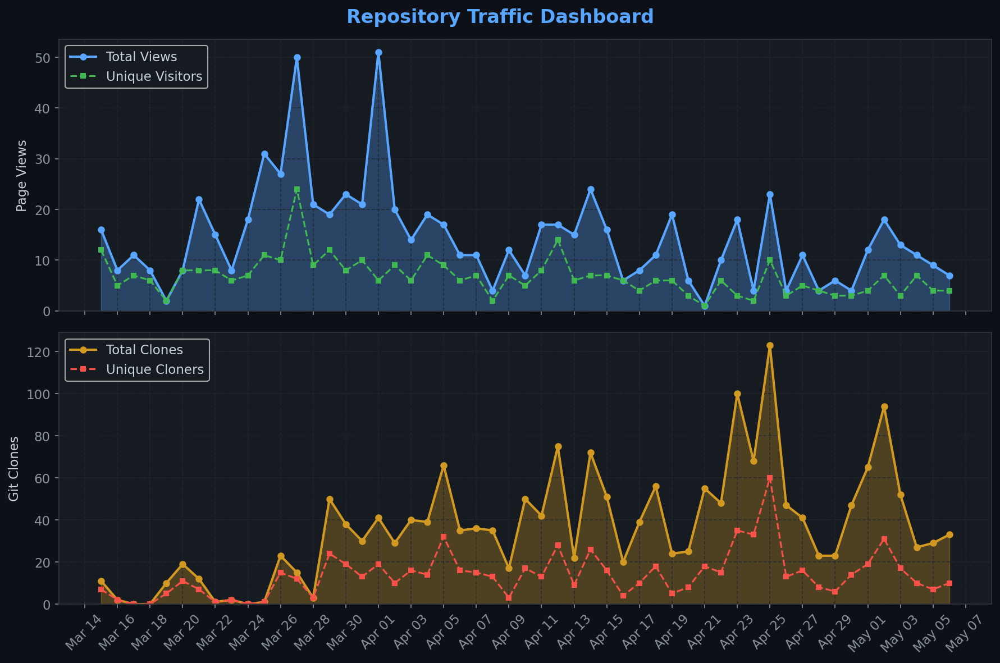
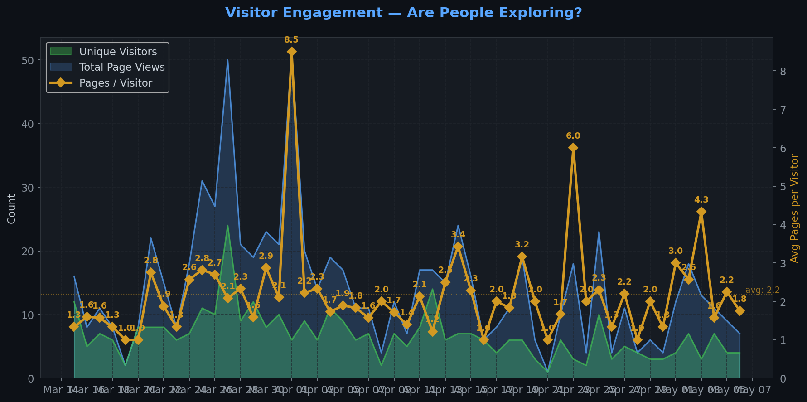
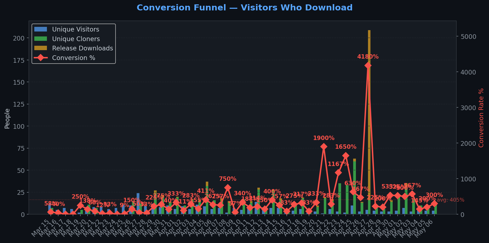
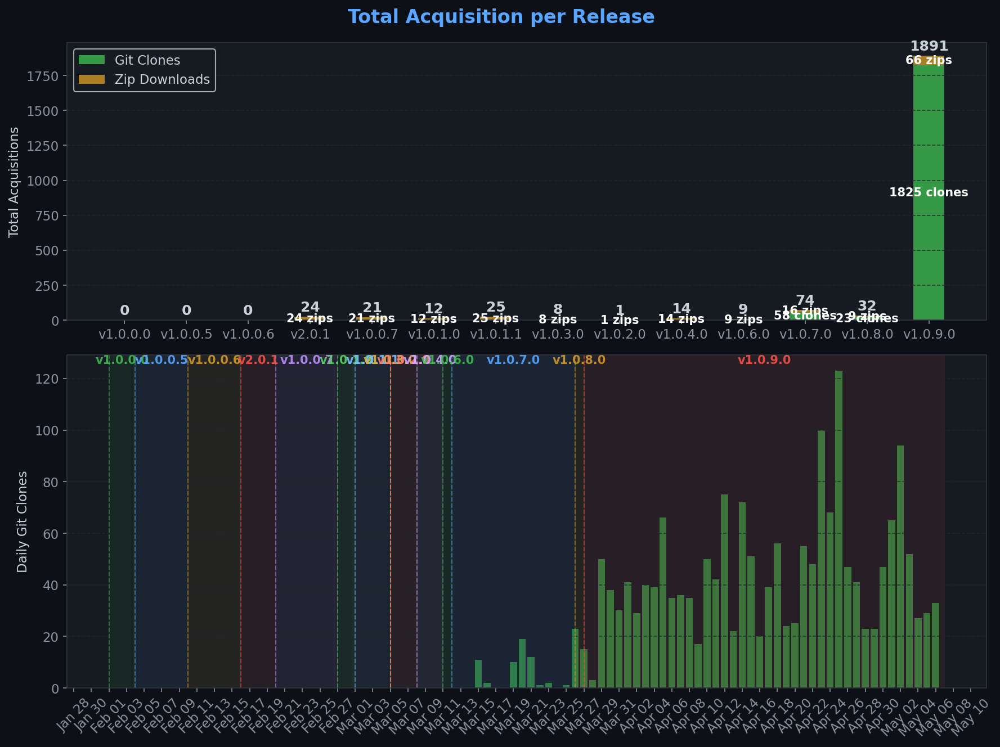
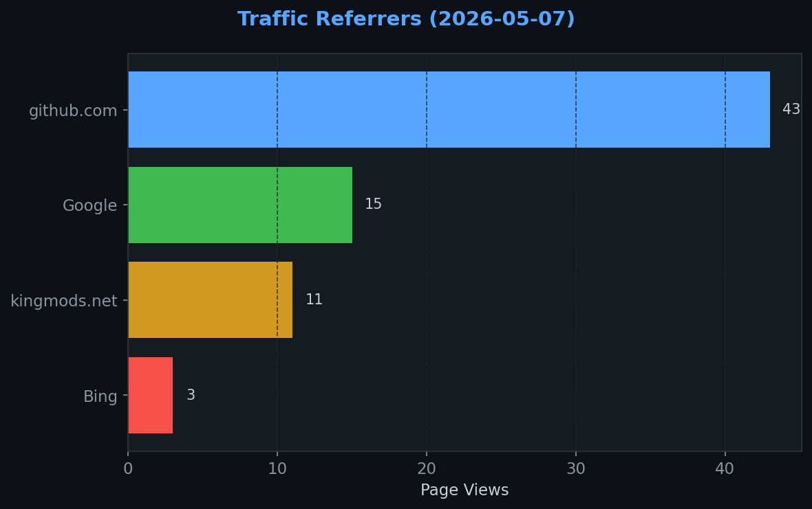
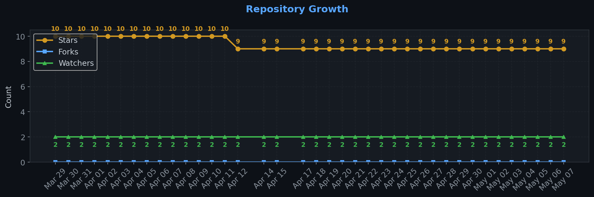

# Repository Traffic Dashboard

**Last updated:** 2026-05-07T18:19:10Z
**Days tracked:** 38 | **Download snapshots:** 123 (hourly)

---

## Views & Clones (14-day window, preserved forever)

| Metric | 14-Day Total | Unique |
|--------|-------------|--------|
| Page Views | 144 | 46 |
| Git Clones | 772 | 246 |

> **Engagement:** 3.1 pages per visitor (14-day avg)

---

## Visitor Engagement

> Higher = visitors exploring more pages. 1.0 = bounce. 3.0+ = deeply engaged.

---

## Conversion Funnel

> **14-day conversion:** 451 of 46 visitors cloned or downloaded (**980.4%**)
>
> Unique cloners: 246 | Release downloads: 205

---

## Total Acquisition per Release (Downloads + Clones)

| Channel | Count |
|---------|-------|
| Zip Downloads | 205 |
| Git Clones (14-day) | 772 |
| **Total Acquisitions** | **977** |

---

## Referrers

| Source | Views | Unique |
|--------|-------|--------|
| github.com | 43 | 23 |
| Google | 15 | 12 |
| kingmods.net | 11 | 4 |
| Bing | 3 | 2 |

---

## Repository Growth

| Metric | Current |
|--------|---------|
| Stars | 9 |
| Forks | 0 |
| Watchers | 2 |

---

## Top Pages (14-day)

| Page | Views | Unique |
|------|-------|--------|
| `/TheCodingDad-TisonK/FS25_WorkerCosts` | 118 | 44 |
| `/TheCodingDad-TisonK/FS25_WorkerCosts/releases/tag/v1.0.9.0` | 8 | 8 |
| `/TheCodingDad-TisonK/FS25_WorkerCosts/releases` | 6 | 6 |
| `/TheCodingDad-TisonK/FS25_WorkerCosts/releases/tag/v1.0.4.0` | 5 | 2 |
| `/TheCodingDad-TisonK/FS25_WorkerCosts/issues` | 2 | 2 |
| `/TheCodingDad-TisonK/FS25_WorkerCosts/releases/tag/v1.0.1.1` | 2 | 2 |
| `/TheCodingDad-TisonK/FS25_WorkerCosts/blob/main/CLAUDE.md` | 1 | 1 |
| `/TheCodingDad-TisonK/FS25_WorkerCosts/blob/main/modDesc.xml` | 1 | 1 |
| `/TheCodingDad-TisonK/FS25_WorkerCosts/compare/v1.0.4.0...main` | 1 | 1 |

---

## Data Files

| File | Description | Granularity |
|------|-------------|-------------|
| [daily.json](daily.json) | Views & clones per day (never expires) | Daily |
| [downloads.json](downloads.json) | Release download snapshots | Hourly |
| [referrers.json](referrers.json) | Referrer snapshots | Daily |
| [metadata.json](metadata.json) | Stars, forks, watchers | Daily |
| [stats.json](stats.json) | Combined legacy snapshots | 6-hourly |

---
*Hourly download tracking + full dashboard with engagement metrics every 6 hours*
*Auto-generated by [traffic-stats.yml](../../.github/workflows/traffic-stats.yml)*
