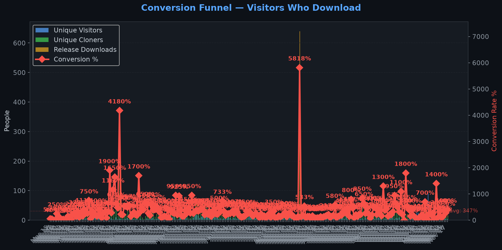
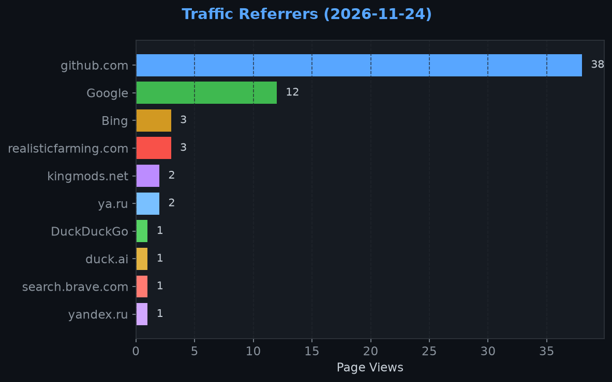

# Repository Traffic Dashboard

**Last updated:** 2026-11-18T18:32:37Z
**Days tracked:** 187 | **Download snapshots:** 809 (hourly)

---

## Views & Clones (14-day window, preserved forever)

| Metric | 14-Day Total | Unique |
|--------|-------------|--------|
| Page Views | 219 | 166 |
| Git Clones | 228 | 93 |

> **Engagement:** 1.3 pages per visitor (14-day avg)

---

## Visitor Engagement

> Higher = visitors exploring more pages. 1.0 = bounce. 3.0+ = deeply engaged.

---

## Conversion Funnel

> **14-day conversion:** 1073 of 166 visitors cloned or downloaded (**646.3%**)
>
> Unique cloners: 93 | Release downloads: 980

---

## Total Acquisition per Release (Downloads + Clones)

| Channel | Count |
|---------|-------|
| Zip Downloads | 980 |
| Git Clones (14-day) | 228 |
| **Total Acquisitions** | **1208** |

---

## Referrers

| Source | Views | Unique |
|--------|-------|--------|
| aocr.org | 88 | 87 |
| github.com | 41 | 33 |
| Google | 17 | 14 |
| realisticfarming.com | 3 | 3 |
| Bing | 2 | 2 |
| ya.ru | 2 | 2 |
| DuckDuckGo | 1 | 1 |
| duck.ai | 1 | 1 |

---

## Repository Growth

| Metric | Current |
|--------|---------|
| Stars | 21 |
| Forks | 2 |
| Watchers | 0 |

---

## Top Pages (14-day)

| Page | Views | Unique |
|------|-------|--------|
| `/Realistic-Farming/FS25_WorkerCosts` | 82 | 59 |
| `/Realistic-Farming/FS25_WorkerCosts/releases/tag/v2.3.0.1` | 27 | 24 |
| `/Realistic-Farming/FS25_WorkerCosts/issues/1` | 17 | 17 |
| `/Realistic-Farming/FS25_WorkerCosts/issues/73` | 7 | 7 |
| `/Realistic-Farming/FS25_WorkerCosts/issues/78` | 6 | 6 |
| `/Realistic-Farming/FS25_WorkerCosts/issues/54` | 6 | 5 |
| `/Realistic-Farming/FS25_WorkerCosts/issues/28` | 5 | 5 |
| `/Realistic-Farming/FS25_WorkerCosts/issues/38` | 5 | 5 |
| `/Realistic-Farming/FS25_WorkerCosts/issues/69` | 5 | 5 |
| `/Realistic-Farming/FS25_WorkerCosts/issues/74` | 5 | 5 |

---

## Data Files

| File | Description | Granularity |
|------|-------------|-------------|
| [daily.json](daily.json) | Views & clones per day (never expires) | Daily |
| [downloads.json](downloads.json) | Release download snapshots | Hourly |
| [referrers.json](referrers.json) | Referrer snapshots | Daily |
| [metadata.json](metadata.json) | Stars, forks, watchers | Daily |
| [stats.json](stats.json) | Combined legacy snapshots | 6-hourly |

---
*Hourly download tracking + full dashboard with engagement metrics every 6 hours*
*Auto-generated by [traffic-stats.yml](../../.github/workflows/traffic-stats.yml)*
