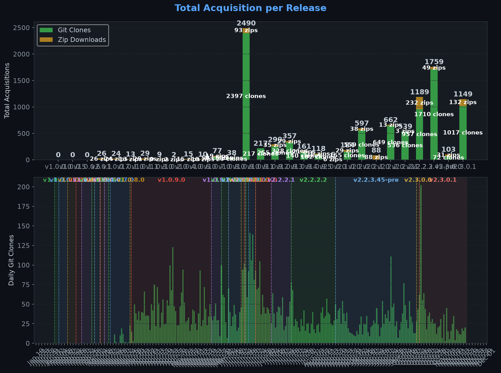
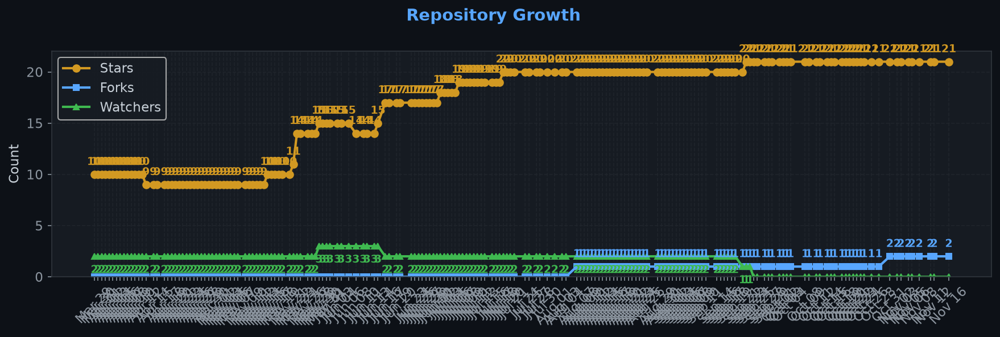

# Repository Traffic Dashboard

**Last updated:** 2026-11-24T18:31:27Z
**Days tracked:** 192 | **Download snapshots:** 827 (hourly)

---

## Views & Clones (14-day window, preserved forever)

| Metric | 14-Day Total | Unique |
|--------|-------------|--------|
| Page Views | 119 | 81 |
| Git Clones | 263 | 112 |

> **Engagement:** 1.4 pages per visitor (14-day avg)

---

## Visitor Engagement

> Higher = visitors exploring more pages. 1.0 = bounce. 3.0+ = deeply engaged.

---

## Conversion Funnel

> **14-day conversion:** 1113 of 81 visitors cloned or downloaded (**1374.0%**)
>
> Unique cloners: 112 | Release downloads: 1001

---

## Total Acquisition per Release (Downloads + Clones)

| Channel | Count |
|---------|-------|
| Zip Downloads | 1001 |
| Git Clones (14-day) | 263 |
| **Total Acquisitions** | **1264** |

---

## Referrers

| Source | Views | Unique |
|--------|-------|--------|
| github.com | 38 | 29 |
| Google | 12 | 12 |
| Bing | 3 | 3 |
| realisticfarming.com | 3 | 3 |
| kingmods.net | 2 | 2 |
| ya.ru | 2 | 2 |
| DuckDuckGo | 1 | 1 |
| duck.ai | 1 | 1 |
| search.brave.com | 1 | 1 |
| yandex.ru | 1 | 1 |

---

## Repository Growth

| Metric | Current |
|--------|---------|
| Stars | 21 |
| Forks | 2 |
| Watchers | 0 |

---

## Top Pages (14-day)

| Page | Views | Unique |
|------|-------|--------|
| `/Realistic-Farming/FS25_WorkerCosts` | 77 | 63 |
| `/Realistic-Farming/FS25_WorkerCosts/releases/tag/v2.3.0.1` | 23 | 21 |
| `/Realistic-Farming/FS25_WorkerCosts/releases` | 8 | 8 |
| `/Realistic-Farming/FS25_WorkerCosts/issues/54` | 6 | 6 |
| `/Realistic-Farming/FS25_WorkerCosts/blob/main/icon.png` | 2 | 2 |
| `/Realistic-Farming/FS25_WorkerCosts/blob/main/README.md` | 1 | 1 |
| `/Realistic-Farming/FS25_WorkerCosts/issues/24` | 1 | 1 |
| `/Realistic-Farming/FS25_WorkerCosts/pulls` | 1 | 1 |

---

## Data Files

| File | Description | Granularity |
|------|-------------|-------------|
| [daily.json](daily.json) | Views & clones per day (never expires) | Daily |
| [downloads.json](downloads.json) | Release download snapshots | Hourly |
| [referrers.json](referrers.json) | Referrer snapshots | Daily |
| [metadata.json](metadata.json) | Stars, forks, watchers | Daily |
| [stats.json](stats.json) | Combined legacy snapshots | 6-hourly |

---
*Hourly download tracking + full dashboard with engagement metrics every 6 hours*
*Auto-generated by [traffic-stats.yml](../../.github/workflows/traffic-stats.yml)*
